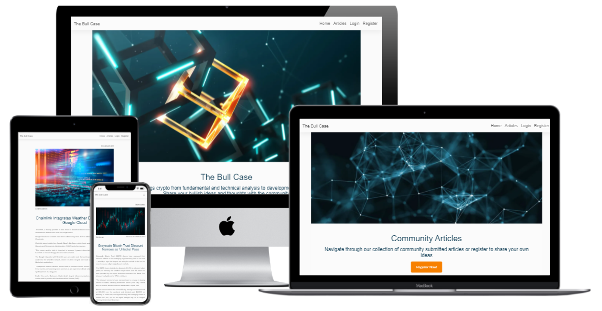
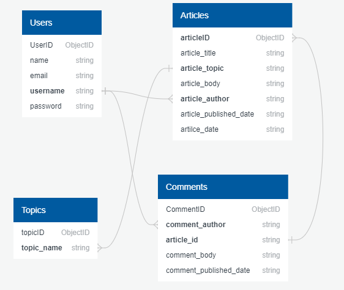

# The Bull Case

The Bull Case aims to provide a place for blockchain enthusiasts to research, keep up to date and share their own thoughts on everything Crypto!
You can find a live link to the app [HERE](https://the-bull-case.herokuapp.com/)

## Table of Contents:

- [UX](#ux)
  - [User Stories](#user-stories)
  - [Strategy](#strategy)
  - [Scope](#scope)
  - [Structure](#structure)
  - [Skeleton](#skeleton)
  - [Surface](#surface)
- [Features](#features)
  - [Deployed Features](#deployed-features)
  - [Features to consider implementing in the future](#features-to-consider-implementing-in-the-future)
- [Technologies Used](#technologies-used)
  - [Languages](#languages)
  - [Frameworks and Tools](#frameworks-and-tools)
  - [Workspace and Related Tools](#workspace-and-related-tools)
- [Resources](#resources)
- [Code Validation Tools](#code-validation-tools)
- [Testing](#testing)
- [Deployment](#deployment)
- [Acknowledgments](#acknowledgments)

## UX

### User Stories

- User 1: I want an easy to use site which has a simple layout and an easy registration process
- User 2: I want a place where i can come and view the latest Crypto news.
- User 3: I want a place where i can research specifically fundamental analysis of cryptocurrencies.
- User 4: I am interested in the crypto space and love to give feedback on information pieces
- User 5: I have developed a new cryptocurrency project and would like a place to post articles sharing information about my project.

### Strategy
- Provide a platform where users can educate themselves on all aspects of the Crypto space
- Provide a route away from the conventions of social media where people can share their ideas and thoughts in article form

### Scope 
- An easy to navigate site with simple register, login and logout functions
- Articles can be filetered by topic using tabs
- Allows users to create, read, update and delete their submitted articles

### Structure
I wanted to create a simple and distraction free platform where the user experience and attention is always kept and directed towards the content of the site. 
For this reason the functionality is limited to not take away from the sole purpose of the site: a simple knowledge resource.
The structure and layout of pages is very similar across the board and allows for easy navigation without distraction

### Skeleton
- [Wireframes](static/docs/wireframes.pdf) - The final commit has not differed much from the initial intentions highlighted in the wireframes
- Navigation Bar
- - Home - Homepage containing call to action, blurb on purpose of site and a few featured articles
- - Articles - Call to action to post article with articles below catagorised by topic on different tabs
- - Post Article - Form to contribute an article including TinyMCE textarea
- - Article - Article page displaying topic, image, author, date published and the article body with a comments section at the bottom
- - Login - Simple login form requesting username and password. Link at bottom of form to register if not already
- - Register - Simple register form requesting full name, email address, username and password. Link at bottom of form to login if already registered
- - Profile - Contains all articles contributed by user with buttons to read, edit and delete articles. Delete articles propmts a modal to make sure the user wants to delete
- - Edit - Allows user to edit article with pre-populated fields containing original article
-
#### Database Diagram

### Surface
The intention for the design was to keep everything simple and not take away from the content
#### Colours
The base colour was kept as white #fafafa with #545454 used for most fonts. There is some colour added on buttons but generally the main colour on the site comes from the images throughout which are supposed to represent blockchain related tech and imagery
#### Fonts
I used the proxima-nova font with 300 weighting and sans-serif as backup

## Features
### Deployed Features
- Collapsable navigation bar from MDBootstrap
- Call to actions to either register/login or create an article
- Featured articles on the home page
- Articles page with tabs organised by topics for easily identiying the content the user perfers
- Comment section under each article for further discussion
- Edit and delete functionality for the author of an article
- Register, Login and Logout functionality

### Features to consider implementing in the future
- The ability to travel to an authors profile to read more of their articles
- Coin metrics integration through an API

## Technologies Used

### Languages
- [HTML5](https://en.wikipedia.org/wiki/HTML5)
- [CSS](https://en.wikipedia.org/wiki/CSS)
- [JavaScript](https://en.wikipedia.org/wiki/JavaScript)
- [Python](<https://en.wikipedia.org/wiki/Python_(programming_language)>)

### Frameworks and Tools

- [FontAwesome](https://fontawesome.com/) - Used for icons
- [MDBootstrap](https://mdbootstrap.com/) - CSS framework
- [jQuery](https://jquery.com/) - JavaScript library.
- [Flask](https://flask.palletsprojects.com/en/1.1.x/) - Python framework for building web applications
- [Jinja2](https://jinja.palletsprojects.com/en/3.0.x/) - Templating engine to compliment Flask & Python
- [MongoDB](https://www.mongodb.com/) - NoSQL database program, using JSON-like documents.
- [ImageKit](https://imagekit.io/) - Used to host images for display on site
- - ImageKit enables automatic optimisation and real time transformation to resize images depending on the screen size in use

### Workspace and Related Tools
- [Gitpod](https://www.gitpod.io/) - Integrated Development Environment used to write the code
- [GitHub](https://github.com/) - Repository hosting service
- [Git](https://git-scm.com/) - Version control tool to manage any changes and allow to revert to previous version
- [Heroku](https://www.heroku.com/) - Cloud based platform for hosting web applications feeding straight from the GitHub repository

## Resources
- [Stack Overflow](https://stackoverflow.com/) - Educational resource
- [Youtube](https://www.youtube.com/) - Tutorial resource
- [Balsamiq](https://balsamiq.com/wireframes/) - Used to generate Wireframes
- [W3Schools](https://www.w3schools.com/js/default.asp) - Used to check up on methods etc.
- [Quick DBD](https://www.quickdatabasediagrams.com/) - Database diagram visualisation tool
- [Coolors](https://coolors.co/) - Help find suitable complimentary colours for the site

## Code Validation Tools
- [WC3 HTML Validator](https://validator.w3.org/) - Used to test HTML code
- [WC3 CSS Validator](https://jigsaw.w3.org/css-validator/) - Used to test CSS code
- [JS Hint](https://jshint.com/) - Used to test JavaScript
- [PEP8 online](http://pep8online.com/) - Used to test Python code was written to PEP8 standards

## Testing
Testing documentation for this project can be found [HERE](static/docs/TESTING.md)

## Deployment
This project is hosted on Heroku. I deployed the flask app to Heroku on my first day working on it in order to be able to test out deployed features as i coded

- Login to Heroku and press 'New' in the top right corner, then press 'Create New App'
- Next I entered the name of the project and the nearest region to me
- Next I navigated to 'Settings' and then 'Config Vars'. From here I proceeded to add the configuration variables that I had set up in my env.py - IP, Port, Secret Key, MONGO URI and MONGODB NAME.
- After this I navigated to the Deploy section.
- Next I connected my GitHub repository for the project under 'Deployment Method'.
- Finally, I selected the main branch and clicked 'Deploy Branch', ensuring Automatic Deployments were enables

# Acknowledgments
- A big thanks to my great mentor Excellence Ilesanmi for helping and guiding me along the way
- Thanks to the Code Institute whos tuition has brought my skills to a level to be able to achieve this. The tutor support have been very helpful and patient
