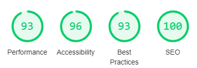
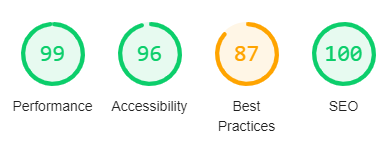

# Testing

## User Stories

User 1: I want an easy to use site which has a simple layout and an easy registration process
- Test - The site has proved simple to navigate on both desktop and mobile and the registration, article submission and commenting functionality is striaght forward

User 2: I want a place where i can come and view the latest Crypto news.
- Test - When I viewed the home page i am initially greeted with some feature articles and an easy to navigate Nav bar to take me to further content

User 3: I want a place where i can research specifically fundamental analysis of cryptocurrencies.
- Test - When i navigated to the Articles section of the website I can use the handy tabs to specifically see only fundamental analysis articles. The featured articles on the home page also contain a topic tag which helps pick an article from the website loading

User 4: I am interested in the crypto space and love to give feedback on information pieces
- Each article has a simple comments section where i can share my thoughts on a particular piece

User 5: I have developed a new cryptocurrency project and would like a place to post articles sharing information about my project.
- Test - The Bull Case has a dedicated New Projects topic for developers like myself to share our ideas in article form

## Navigation Link Testing
**Nav Bar**
- Checked all nav bar items direct user to correct page including logo returning to home

**Home Page**
- Checked call to action routes to register page if not signed in or to the Create Article page when logged in
- Checked Read button on feature articles correctly opens article
- Checked footer link to Crypto Penguin is working and opens in a seperate tab

**Register**
- Checked Already Registered link directs to the login page
- Checked that when registration complete, user is redirtected to their profile 

**Login**
- Checked Not Registered link directs to the registration page
- Checked that when logged in, user is redirtected to their profile 

**Articles**
- Checked that all tabs on articles page route to correct article topic group
- Checked Read button on article cards correctly redirects to the article chosen
- Checked the Post Article button directs to the correct page
- Check Register Now button that appears if user not logged in leads to register page

**Post Article**
- Checked the user is redirected to their profile after posting an article

**Profile**
- Checked Read button on article cards
- Checked that the Edit button opens the Post Article page with the article information filled in for editing
- Checked the Delete button opens a modal with the article name 
- - Checked the Yes Delete button returns to the profile
- - Checked the No Thanks button returns to the profile
- - Checked the X closes the modal and returns to the profile

## Page Functionality Testing
### Nav Bar
- Checked that Login and Register appear if no user is logged in
- Checked that Profile and Logout appear if user is signed in

### Register
- Checked flash message appears if user tries to register with an existing username
- Checked email field requires email formatting
- Checked username and password will show error is special characters used

### Login
- Checked flash messages states username/password incorrect if user fails to login

### Logout
- Checked that logout button returns to Login page with flashed message notifying user they have been logged out

### Profile
- Checked welcome flash message appears upon login
- Checked profile titled as usernames profile
- Checked Create First Article button shows if user has no articles
- - Checked this button routes to Post Article page
- Checked Edit button routes to Edit page
- Checked Delete fucntionality works and removes article from database

### Edit Article
- Checked article fields are populated and changes made are updated when update article is clicked

### Home
- Checked that the call of action is set to register if user not logged in and Post Article if user already logged in
- Checked Featured Articles display 4no. most recent articles

### Articles
- Checked the correct articles are sorting by topic on each tab

### Post Article
- Checked post article functionality is working

### Article
- Checked article displaying correctly with relevant data
- Checked comment functionality is working correctly
- - Checked only user can delete comment they made

### 404 Page
- Checked route is working as intended and 404 page is displayed if invalid link entered
- Checked Return to Home button reirects to the home page

### 500 Page
Checked route works as intended and displays if internal server error is encountered

## Responsiveness
Responsiveness was checked using [Responsinator](https://www.responsinator.com/) while also designed with responsiveness in mind with regular testing on Dev Tools. The responsiveness has been tested across multiple devices such as iPhone 8, iPhone 8 Plus, iPhone X, Samusing Galaxy X5, iPad etc.

## Usability 
Prior to submission, I deployed the site to GitHub Pages in order to be able to share a link to the site with some friends who are also interested in Cryptocurrency. All of the feedback was very positive, each friend found it easy to use

## Performance
I tested the performance of the app with Lighthouse. Displayed below are results for both mobile and desktop of the 'Articles' page
#### Mobile Report of Articles Page
- 

#### Desktop Report of Articles Page
- 

